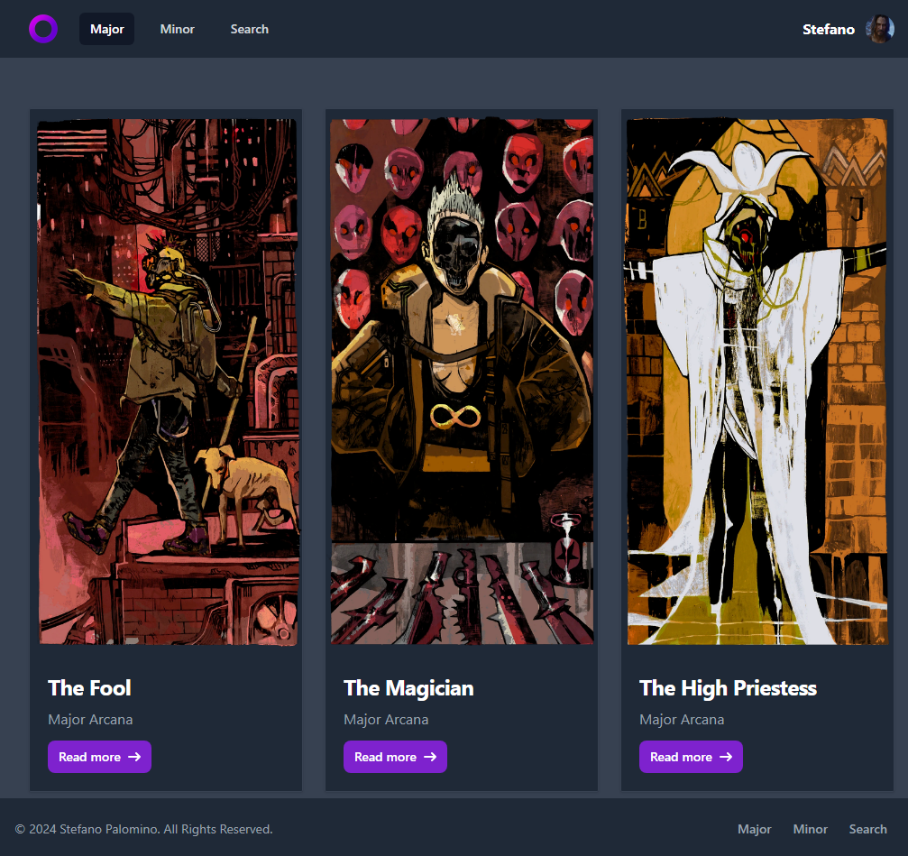

# Tarot Cards



Aplicación web para leer cartas de tarot con temática CyberPunk 2077. La aplicación cuenta con un sistema de lectura y búsqueda de cartas y un sistema de interpretación de resultados. Además, cuenta con un sistema de protección de rutas.

## Tecnologías

- JavaScript
- React
- React Router
- Tailwind CSS

## Requisitos

- Node.js
- npm
- yarn

## Instalación

Clona el repositorio y navega hasta el directorio:

```bash
git clone https://github.com/StefanoP21/tarot-spa.git
```

## Instala las dependencias:

```bash
npm install
#or
yarn add
```

## Ejecución en modo de desarrollo

Para iniciar la aplicación en modo de desarrollo, ejecuta:

```bash
npm run dev
#or
yarn dev
```

## Ejecución de las pruebas

Para iniciar las pruebas de la aplicación, ejecuta:

```bash
npm run test
#or
yarn test
```

## Ejecución en modo de producción

Para construir la aplicación para producción, ejecuta:

```bash
npm run build
#or
yarn build
```
